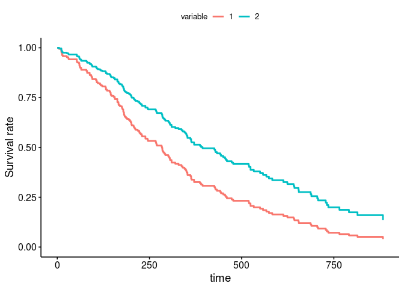

<!-- README.md is generated from README.Rmd. Please edit that file -->

# survivalGPU 

<!-- badges: start -->

[](https://github.com/jeanfeydy/survivalGPU/actions/workflows/R-CMD-check.yaml)
<!-- badges: end -->

The survivalGPU library allows you to perform survival analyzes using
the resources of Graphic Processing Units (GPU) in order to accelerate
the speed of calculations. Currently, two models have been implemented :

- Cox Proportional Hazards regression model  
- Weighted Cumulative Exposure model

It’s also possible to use the library without having Graphics Processing
Units (with CPU).

## Installation

survivalGPU is a package based on a package written in python, dependant
on the `reticulate` R package. To use it, it’s necessary to have
installed some python libraries such as `torch`, `torch-scatter`, and
`pykeops`. To use survivalGPU, you can create a virtual python
environment through `reticulate`. It’s highly recommended to not to use
the default python executable.

``` r
library(reticulate)

virtualenv_create("survivalGPU")
virtualenv_install("survivalGPU", packages = c("torch"))
virtualenv_install("survivalGPU", packages = c("torch_scatter", "pykeops",
                                               "matplotlib", "beartype",
                                               "jaxtyping"))
# torch takes a long time to set up
```

To configure properly and understand your python environment, check
`vignette("python_connect")`

survivalGPU require submodules : you can install the development version
of survivalGPU from [GitHub](https://github.com/) with
`install_git_with_submodule()`:

``` r
# install.packages("devtools")

install_git_with_submodule <- function(x, subdir) {
  install_dir <- tempfile()
  system(paste("git clone --recursive", shQuote(x), shQuote(install_dir)))
  
  # change name for windows install
  file.rename(file.path(install_dir, "R/inst/python/survivalgpu"),
              file.path(install_dir, "R/inst/python/survivalgpu_submodule"))
  file.copy(file.path(install_dir, "python/survivalgpu"),
            file.path(install_dir, "R/inst/python"), recursive = TRUE)
  
  devtools::install(file.path(file.path(install_dir, subdir)))
}

install_git_with_submodule("https://github.com/jeanfeydy/survivalGPU",
                           subdir = "R")
```

> **Warning**: Currently, survivalGPU is not available for Windows.

## Example

Let’s make a small example for a Cox PH model with `lung` cancer dataset
from `survival` package. Before load `survivalGPU`, use your virtual
python environment (see above or `vignette("python_connect")`).

``` r
library(reticulate)
use_virtualenv(virtualenv = "survivalGPU")
```

``` r
library(survivalGPU)
library(survival)
```

Check if CUDA is detected :

``` r
use_cuda()
#> [KeOps] Warning : cuda was detected, but driver API could not be initialized. Switching to cpu only.
#> [1] FALSE
```

By default, functions run with GPU if detected. Then we specify the
number of bootstrap, and consequently the batchsize argument, according
to CUDA drivers detection.

``` r
if (use_cuda()) {
  n_bootstrap <- 1000
  batchsize <- 200
} else {
  n_bootstrap <- 50
  batchsize <- 10
}
```

You can realize the Cox model with the `coxphGPU()` function, which is
written in the same way as the `survival::coxph()` function from
survival package, with a Surv object in the formula.

``` r
coxphGPU_bootstrap <- coxphGPU(Surv(time, status) ~ age + sex + ph.ecog,
                               data = lung,
                               bootstrap = n_bootstrap,
                               batchsize = batchsize,
                               ties = "breslow")
```

With `summary` method, you obtain results for initial model, and a
confidence interval by normal distribution process. A confidence
interval is also estimated for coefficients by bootstrap (if bootstrap
\> 1 in your coxphGPU object).

``` r
summary(coxphGPU_bootstrap)
#> Call:
#> coxphGPU.default(formula = Surv(time, status) ~ age + sex + ph.ecog, 
#>     data = lung, ties = "breslow", bootstrap = n_bootstrap, batchsize = batchsize)
#> 
#>   n= 227, number of events= 164 
#>    (1 observation effacée parce que manquante)
#> 
#>              coef exp(coef)  se(coef)      z Pr(>|z|)    
#> age      0.011041  1.011102  0.009267  1.191    0.233    
#> sex     -0.551890  0.575861  0.167742 -3.290    0.001 ** 
#> ph.ecog  0.462947  1.588749  0.113574  4.076 4.58e-05 ***
#> ---
#> Signif. codes:  0 '***' 0.001 '**' 0.01 '*' 0.05 '.' 0.1 ' ' 1
#> 
#>         exp(coef) exp(-coef) lower .95 upper .95
#> age        1.0111     0.9890    0.9929     1.030
#> sex        0.5759     1.7365    0.4145     0.800
#> ph.ecog    1.5887     0.6294    1.2717     1.985
#> 
#> Concordance= 0.637  (se = 0.025 )
#> Likelihood ratio test= 30.41  on 3 df,   p=1e-06
#> Wald test            = 29.84  on 3 df,   p=1e-06
#> Score (logrank) test = 30.41  on 3 df,   p=1e-06
#> 
#>  ---------------- 
#> Confidence interval with 50 bootstraps for exp(coef), conf.level = 0.95 :
#>             2.5%    97.5%
#> age     0.991309 1.030620
#> sex     0.397429 0.872966
#> ph.ecog 1.237810 1.927180
```

To visualize your model, you can plot adjusted survival curves with
`survminer::ggadjustedcurves()`.

``` r
survminer::ggadjustedcurves(coxphGPU_bootstrap,
                            variable = "sex",
                            data = lung)
```



If you have no model, it’s possible to estimate survival curves with
Kaplan-Meier estimation by `survival::survfit()`, and you can use
`survminer::ggsurvplot()` to plot a Kaplan-Meier survival curve.

Moreover, it’s possible to evaluate proportional hazards assumption, and
plot a forestplot of your model. All is explain in the
`vignette("coxPH")`.

## Vignettes

- `vignette("coxPH")`  
- `vignette("WCE")`  
- `vignette("python_connect")`
