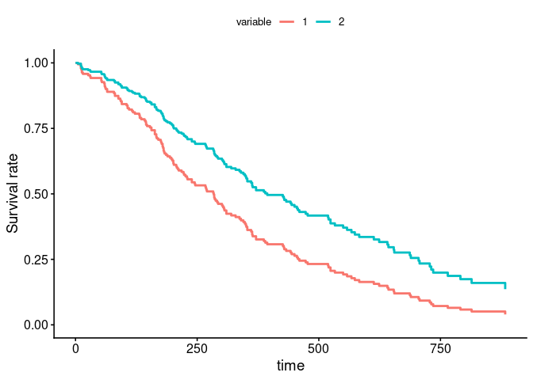

<!-- README.md is generated from README.Rmd. Please edit that file -->

# survivalGPU 

<!-- badges: start -->

[](https://github.com/jeanfeydy/survivalGPU/actions/workflows/R-CMD-check.yaml)
<!-- badges: end -->

**GPU-accelerated survival analysis** — Cox Proportional Hazards (CoxPH)
and Weighted Cumulative Exposure (WCE) models, built on
[PyTorch](https://pytorch.org), with an R interface via
[reticulate](https://rstudio.github.io/reticulate/). The WCE model
additionally relies on [KeOps](https://www.kernel-operations.io).
survivalGPU scales classical survival models to large datasets and to
heavy bootstrap resampling by running the core computations on the GPU.
It’s also possible to use the library without a GPU (CPU fallback).

## Features

-   **Cox Proportional Hazards** models (`coxphGPU()`), with Breslow and
    Efron handling of ties, built as a drop-in companion to
    `survival::coxph()`. Only requires PyTorch — works on Windows.
-   **Weighted Cumulative Exposure (WCE)** models (`wceGPU()`) for
    time-varying exposure effects, built as a drop-in companion to
    `WCE::WCE()`. Requires the optional `pykeops` package, which is
    **not available on Windows** (see below); `wceGPU()` raises an
    informative error if it’s missing.
-   **GPU acceleration** of the likelihood and its gradients via PyTorch
    (+ KeOps for WCE), with a CPU fallback (`use_cuda()` to check what’s
    available).
-   **Bootstrap** resampling for confidence intervals on both models.

## Installation

survivalGPU wraps a Python backend (via the `reticulate` R package), so
it needs a working Python environment with `torch` installed (`pykeops`
too, if you need `wceGPU()`). To configure this properly, check
`vignette("python_connect")` — the short version:

``` r
library(reticulate)

virtualenv_create("survivalGPU")
# Add "pykeops" to this list if you need wceGPU() (not available on Windows):
virtualenv_install("survivalGPU", packages = c("torch", "matplotlib",
                                               "beartype", "jaxtyping"))
# torch takes a long time to set up
```

### Requirements

-   **R \>= 4.1**
-   **Python \>= 3.10**
-   **A C++ compiler (WCE only):**
    [`pykeops`](https://www.kernel-operations.io) just-in-time compiles
    C++/CUDA kernels at runtime, so a working C++ toolchain must be
    present. For GPU acceleration you also need the **CUDA toolkit**
    (`nvcc`) installed, not just a CUDA-capable GPU — the code runs on
    CPU without one, the GPU is simply where the speedups come from.
    `coxphGPU()` doesn’t need any of this.

### macOS (Apple Silicon)

> **Known issue:** calling `coxphGPU()`/`wceGPU()` from R currently
> crashes with a native segfault on macOS, specifically when Python is
> embedded via `reticulate` — see [MACOS_SEGFAULT.md](MACOS_SEGFAULT.md)
> for the full investigation. It does **not** affect the [Python
> package](https://github.com/jeanfeydy/survivalGPU/tree/main/python)
> used directly, without R. If you’re on macOS and need the package
> working today, use the Python package directly rather than the R
> wrapper.

`pykeops` needs [OpenMP](https://www.openmp.org), which isn’t bundled
with Apple’s compiler toolchain on Apple Silicon (M1/M2/M3/M4). Without
it, `pykeops` disables OpenMP and falls back to a much less-tested code
path — we’ve seen this cause crashes. Install it via Homebrew before
setting up your Python environment:

``` bash
brew install libomp
```

### Windows

`coxphGPU()` installs and runs natively on Windows. **pykeops**, needed
only for `wceGPU()`, compiles C++/CUDA kernels at runtime and is **not
supported natively on Windows**. See the [Python package’s
README](https://github.com/jeanfeydy/survivalGPU/blob/main/python/README.md#windows)
for working alternatives (WSL2, Docker) if you need `wceGPU()`.

The R package and its Python backend live together in the same
[GitHub](https://github.com/) repository (no git submodule involved), so
you can install the development version of survivalGPU directly with:

``` r
# install.packages("remotes")
remotes::install_github("jeanfeydy/survivalGPU", subdir = "R")
```

## Quick start

Let’s make a small example for a Cox PH model with the `lung` cancer
dataset from the `survival` package. Before loading `survivalGPU`, use
your virtual Python environment (see above or
`vignette("python_connect")`).

``` r
library(reticulate)
use_virtualenv(virtualenv = "survivalGPU")
```

``` r
library(survivalGPU)
library(survival)
```

Check if CUDA is detected :

``` r
use_cuda()
#> [KeOps] Warning : CUDA libraries not found or could not be loaded; Switching to CPU only.
#> [1] FALSE
```

By default, functions run with GPU if detected. Then we specify the
number of bootstrap, and consequently the batchsize argument, according
to CUDA drivers detection.

``` r
if (use_cuda()) {
  n_bootstrap <- 1000
  batchsize <- 200
} else {
  n_bootstrap <- 50
  batchsize <- 10
}
```

You can realize the Cox model with the `coxphGPU()` function, which is
written in the same way as the `survival::coxph()` function from
survival package, with a Surv object in the formula. If you use
`bootstrap`, `patient_id` must be provided: it identifies each patient
(subject) in `data`, so that bootstrap resampling is performed at the
patient level rather than at the row level (relevant when a patient has
several rows, e.g. with time-varying covariates).

``` r
lung <- lung[stats::complete.cases(lung[c("time", "status", "age", "sex", "ph.ecog")]), ]
lung$id <- seq_len(nrow(lung)) # one row per patient here, so a row index works as patient_id

coxphGPU_bootstrap <- coxphGPU(Surv(time, status) ~ age + sex + ph.ecog,
                               data = lung,
                               patient_id = "id",
                               bootstrap = n_bootstrap,
                               batchsize = batchsize,
                               ties = "breslow")
```

With `summary` method, you obtain results for initial model, and a
confidence interval by normal distribution process. A confidence
interval is also estimated for coefficients by bootstrap (if bootstrap
\> 1 in your coxphGPU object).

``` r
summary(coxphGPU_bootstrap)
#> Call:
#> coxphGPU.default(formula = Surv(time, status) ~ age + sex + ph.ecog,
#>     data = lung, ties = "breslow", patient_id = "id", bootstrap = n_bootstrap,
#>     batchsize = batchsize)
#>
#>   n= 227, number of events= 164
#>
#>              coef exp(coef)  se(coef)      z Pr(>|z|)
#> age      0.011041  1.011102  0.009267  1.191    0.233
#> sex     -0.551890  0.575861  0.167742 -3.290    0.001 **
#> ph.ecog  0.462947  1.588749  0.113574  4.076 4.58e-05 ***
#> ---
#> Signif. codes:  0 '***' 0.001 '**' 0.01 '*' 0.05 '.' 0.1 ' ' 1
#>
#>         exp(coef) exp(-coef) lower .95 upper .95
#> age        1.0111     0.9890    0.9929     1.030
#> sex        0.5759     1.7365    0.4145     0.800
#> ph.ecog    1.5887     0.6294    1.2717     1.985
#>
#> Concordance= 0.637  (se = 0.025 )
#> Likelihood ratio test= 30.41  on 3 df,   p=1e-06
#> Wald test            = 29.84  on 3 df,   p=1e-06
#> Score (logrank) test = 30.41  on 3 df,   p=1e-06
#>
#>  ----------------
#> Confidence interval with 50 bootstraps for exp(coef), conf.level = 0.95 :
#>             2.5%    97.5%
#> age     0.995994 1.032250
#> sex     0.463003 0.868341
#> ph.ecog 1.227140 1.896280
```

To visualize your model, you can plot adjusted survival curves with
`survminer::ggadjustedcurves()`.

``` r
survminer::ggadjustedcurves(coxphGPU_bootstrap,
                            variable = "sex",
                            data = lung)
```



If you have no model, it’s possible to estimate survival curves with
Kaplan-Meier estimation by `survival::survfit()`, and you can use
`survminer::ggsurvplot()` to plot a Kaplan-Meier survival curve.

Moreover, it’s possible to evaluate proportional hazards assumption, and
plot a forestplot of your model. All is explain in the
`vignette("coxPH")`.

## Vignettes

-   `vignette("coxPH")`
-   `vignette("WCE")`
-   `vignette("python_connect")`

## Development

Clone the repository and install the R package in development mode:

``` r
# git clone https://github.com/jeanfeydy/survivalGPU.git
# cd survivalGPU/R

devtools::install_deps(dependencies = TRUE)
devtools::load_all()
```

Run the test suite with:

``` r
devtools::test()
```

`coxphGPU()` tests run as long as `reticulate` can reach a Python
environment with `torch` installed. `wceGPU()` tests
([test-wceGPU.R](https://github.com/jeanfeydy/survivalGPU/blob/main/R/tests/testthat/test-wceGPU.R))
additionally need `pykeops` (not available on Windows) in that same
environment — see `vignette("python_connect")` to add it to your
virtualenv. If it’s missing, those tests are skipped with an informative
message instead of failing.

Both cases are exercised in CI (see
[R-CMD-check.yaml](https://github.com/jeanfeydy/survivalGPU/blob/main/.github/workflows/R-CMD-check.yaml)):
one matrix leg installs `pykeops` for real WCE coverage, the others
don’t, to check the graceful-skip path.

## Citation

If you use survivalGPU in your research, please cite it.

    @software{survivalgpu,
      author = {Jean Feydy, Antoine Poirot-Bourdain, Alexis van Straaten},
      title  = {{survivalGPU}: GPU-accelerated survival analysis},
      url    = {https://github.com/jeanfeydy/survivalGPU},
      year   = {2026},
    }

## License

Distributed under the terms of the **LGPL-2.1-or-later** license. See
[LICENSE](https://github.com/jeanfeydy/survivalGPU/blob/main/LICENSE).
