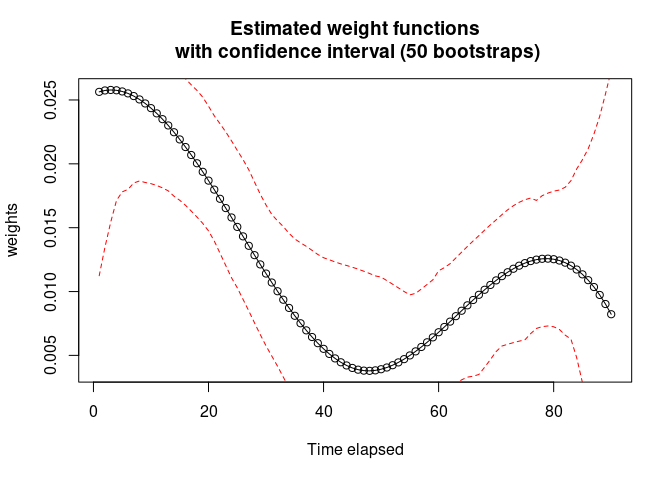

<!-- README.md is generated from README.Rmd. Please edit that file -->

# survivalGPU 

<!-- badges: start -->
<!-- badges: end -->

The survivalGPU library allows you to perform survival analyzes using
the resources of Graphic Processing Units (GPU) in order to accelerate
the speed of calculations. Currently, two models have been implemented :

- `coxphGPU()` for Cox[^1] [^2] model  
- `wceGPU()` for Weighted Cumulative Exposure[^3] model

It’s also possible to use the library without having Graphics Processing
Units (with CPU).

## Installation

### Requirements

Python packages :

- pytorch
- pytorch-scatter
- pykeops (for WCE model)

Actually, survivalGPU is not available for Windows.

survivalGPU require submodules : you can install the development version
of survivalGPU from [GitHub](https://github.com/) with
`install_git_with_submodule()`:

``` r
# install.packages("devtools")

install_git_with_submodule <- function(x, subdir) {
  install_dir <- tempfile()
  system(paste("git clone --recursive", shQuote(x), shQuote(install_dir)))
  
  # change name for windows install
  file.rename(file.path(install_dir,"R/inst/python/survivalgpu"),
              file.path(install_dir,"R/inst/python/survivalgpu_submodule"))
  file.copy(file.path(install_dir,"python/survivalgpu"),
            file.path(install_dir,"R/inst/python"), recursive=TRUE)
  
  devtools::install(file.path(file.path(install_dir,subdir)))
}

install_git_with_submodule("https://github.com/jeanfeydy/survivalGPU",
                           subdir="R")
```

> **Warning**: survivalGPU is a package dependant of python, and it’s
> necessary to have installed the `reticulate` R package. To manage your
> python or miniconda configuration, check vignette(“python_connect”).

## Examples

Let’s make an example with `drugdata` dataset from WCE package.

``` r
library(survivalGPU)
#> Please run `use_cuda()` to check CUDA drivers
library(survival)
library(WCE)
data(drugdata)
```

By default, functions run with GPU if detected. Then we specify the
number of bootstrap, and consequently the batchsize argument, according
to CUDA drivers detection.

``` r
if (use_cuda()) {
  n_bootstrap <- 1000
  batchsize <- 200
} else {
  n_bootstrap <- 50
  batchsize <- 10
}
```

### Cox

You can realize the Cox model with the `coxphGPU` function, which is
written in the same way as the `survival::coxph` function from survival
package, with a Surv object in the formula, containing Start, Stop and
Event variables.

``` r
coxphGPU_bootstrap <- coxphGPU(Surv(Start, Stop, Event) ~ sex + age,
  data = drugdata,
  bootstrap = n_bootstrap,
  batchsize = batchsize
)
```

You obtain with `summary` all results for initial model, and a
confidence interval for estimated coefficients with bootstrap.

``` r
summary(coxphGPU_bootstrap)
#> Call:
#> coxphGPU.default(formula = Surv(Start, Stop, Event) ~ sex + age, 
#>     data = drugdata, bootstrap = n_bootstrap, batchsize = batchsize)
#> 
#> Results without bootstrap :
#> 
#>   n= 77038, number of events= 383 
#> 
#>         coef exp(coef) se(coef)     z Pr(>|z|)    
#> sex 0.620635  1.860108 0.117783 5.269 1.37e-07 ***
#> age 0.010696  1.010754 0.003964 2.698  0.00697 ** 
#> ---
#> Signif. codes:  0 '***' 0.001 '**' 0.01 '*' 0.05 '.' 0.1 ' ' 1
#> 
#>     exp(coef) exp(-coef) lower .95 upper .95
#> sex     1.860     0.5376     1.477     2.343
#> age     1.011     0.9894     1.003     1.019
#> 
#> Concordance= 0.59  (se = 0.018 )
#> Rsquare= 0   (max possible= 0.049 )
#> Likelihood ratio test= 33.88  on 2 df,   p=4e-08
#> Wald test            = 36.27  on 2 df,   p=1e-08
#> Score (logrank) test = 37.27  on 2 df,   p=8e-09
#> 
#>  ---------------- 
#> Confidence interval with 50 bootstraps for exp(coef), conf.level = 0.95 :
#>      2.5% 97.5%
#> sex 1.506 2.269
#> age 1.004 1.020
```

### WCE

WCE allows modeling the cumulative effects of time-varying exposures,
weighted according to their relative proximity in time and represented
by time-dependent covariates. Currently, the weight function is
estimated by the Cox proportional hazards model. To build a model, you
can use the `wceGPU` function in the same way as the `WCE::WCE` function
from WCE package.

``` r
wce_gpu_bootstrap <- wceGPU(
  data = drugdata, nknots = 1, cutoff = 90, id = "Id",
  event = "Event", start = "Start", stop = "Stop",
  expos = "dose", covariates = c("age", "sex"),
  constrained = FALSE, aic = FALSE, confint = 0.95,
  nbootstraps = n_bootstrap, batchsize = batchsize
)
```

In the summary, there are estimated coefficients for the covariates with
his confidence interval, calculated with var-covariance matrix, and
information to see the significance of the covariates. It’s also
possible to have confidence interval with bootstrap.

``` r
summary(wce_gpu_bootstrap)
#> Estimated coefficients for the covariates :
#>       coef CI 2.5 % CI 97.5 % exp(coef) se(coef)   z     p    
#> age 0.0116   0.0038    0.0194    1.0116   0.0040 2.9 0.004 ** 
#> sex 0.6876   0.4546    0.9206    1.9889   0.1189 5.8 7e-09 ***
#> ---
#> Signif. codes:  0 '***' 0.001 '**' 0.01 '*' 0.05 '.' 0.1 ' ' 1
#> 
#> Number of events : 383
#> Partial log-Likelihoods : -1891.64
#> BIC : 3824.92
#> 
#>  ---------------- 
#> With bootstrap (50 bootstraps), conf.level = 0.95 :
#> 
#> CI of estimates :
#>           2.5%     97.5%
#> age 0.00340716 0.0193621
#> sex 0.44109100 0.9042010
```

The risk function can be plot, and if you added bootstrap, confidence
band intervals will be visible.

``` r
plot(wce_gpu_bootstrap)
```



## References

[^1]: Andersen, P. and Gill, R. (1982). Cox’s regression model for
    counting processes, a large sample study. Annals of Statistics 10,
    1100-1120.

[^2]: Therneau, T., Grambsch, P., Modeling Survival Data: Extending the
    Cox Model. Springer-Verlag, 2000.

[^3]: Sylvestre MP, Abrahamowicz M. Flexible modeling of the cumulative
    effects of time-dependent exposures on the hazard. Stat Med. 2009
    Nov 30;28(27):3437-53.
