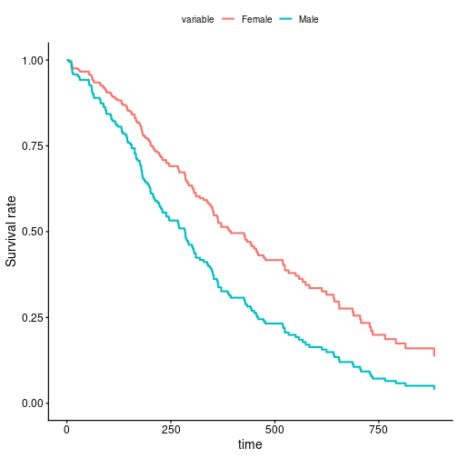
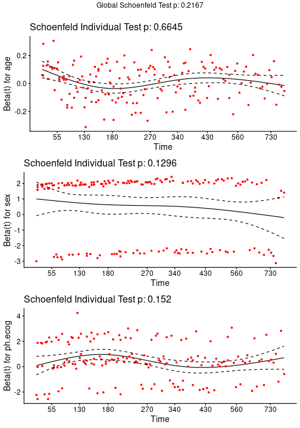
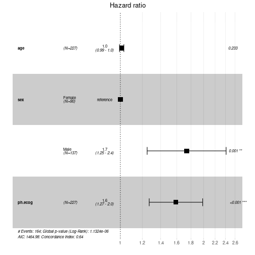

<!-- coxPH.Rmd.orig produces coxPH.Rmd; please edit coxPH.Rmd.orig and run vignettes/precompile.R -->


The Cox proportional hazards model[^cox1] [^cox2] is a semi-parametric regression model for survival (time-to-event) data. It relates the hazard of an event at time $t$ to a set of covariates through a hazard ratio, without requiring the baseline hazard to follow a specific parametric form, and its coefficients are estimated by maximizing a partial likelihood.


Let's make an example with `lung` cancer dataset from survival package. Check `?survival::lung` if you want more explanations about this dataset. Before load `survivalGPU`, use your virtual python environment (see `vignette("python_connect")`).


``` r
library(reticulate)
use_virtualenv(virtualenv = "survivalGPU")
```


``` r
library(survivalGPU)
library(survival)
```


``` r
# ?survival::lung
data <- lung
data$status <- lung$status - 1 # event variable now coded in 0 - 1 (instead of 1 - 2)
data$sex <- ifelse(lung$sex == 1, "Male", "Female")
data <- data[stats::complete.cases(data[c("time", "status", "age", "sex", "ph.ecog")]), ]
data$id <- seq_len(nrow(data)) # one row per patient here, so a row index works as patient_id
head(data)
#>   inst time status age  sex ph.ecog ph.karno pat.karno meal.cal wt.loss id
#> 1    3  306      1  74 Male       1       90       100     1175      NA  1
#> 2    3  455      1  68 Male       0       90        90     1225      15  2
#> 3    3 1010      0  56 Male       0       90        90       NA      15  3
#> 4    5  210      1  57 Male       1       90        60     1150      11  4
#> 5    1  883      1  60 Male       0      100        90       NA       0  5
#> 6   12 1022      0  74 Male       1       50        80      513       0  6
```

You can realize the Cox model with the `coxphGPU()` function, which is written in the same way as the `survival::coxph()` function from survival package, with a Surv object in the formula. If you use `bootstrap`, `patient_id` must be provided: it identifies each patient (subject) in `data`, so that bootstrap resampling is performed at the patient level rather than at the row level (relevant when a patient has several rows, e.g. with time-varying covariates).


``` r
coxphGPU_bootstrap <- coxphGPU(Surv(time, status) ~ age + sex + ph.ecog,
                               data = data,
                               patient_id = "id",
                               bootstrap = 50,
                               ties = "breslow")
#> [KeOps] Warning : CUDA libraries not found or could not be loaded; Switching to CPU only.

# bootstrap at 50 for this example, but normally it's more.
```

You obtain with `summary` all results for initial model, and a confidence interval for estimated coefficients with bootstrap.


``` r
summary(coxphGPU_bootstrap)
#> Call:
#> coxphGPU.default(formula = Surv(time, status) ~ age + sex + ph.ecog,
#>     data = data, ties = "breslow", patient_id = "id", bootstrap = 50)
#>
#>   n= 227, number of events= 164
#>
#>             coef exp(coef) se(coef)     z Pr(>|z|)
#> age     0.011041  1.011102 0.009267 1.191    0.233
#> sexMale 0.551890  1.736531 0.167742 3.290    0.001 **
#> ph.ecog 0.462947  1.588749 0.113574 4.076 4.58e-05 ***
#> ---
#> Signif. codes:  0 '***' 0.001 '**' 0.01 '*' 0.05 '.' 0.1 ' ' 1
#>
#>         exp(coef) exp(-coef) lower .95 upper .95
#> age         1.011     0.9890    0.9929     1.030
#> sexMale     1.737     0.5759    1.2500     2.412
#> ph.ecog     1.589     0.6294    1.2717     1.985
#>
#> Concordance= 0.637  (se = 0.025 )
#> Likelihood ratio test= 30.41  on 3 df,   p=1e-06
#> Wald test            = 29.84  on 3 df,   p=1e-06
#> Score (logrank) test = 30.41  on 3 df,   p=1e-06
#>
#>  ----------------
#> Confidence interval with 50 bootstraps for exp(coef), conf.level = 0.95 :
#>             2.5%   97.5%
#> age     0.993525 1.02171
#> sexMale 1.294340 2.08536
#> ph.ecog 1.302860 2.12898
```

## Survival Curves

You can plot adjusted survival curves with `survminer::ggadjustedcurves()`.


``` r
survminer::ggadjustedcurves(coxphGPU_bootstrap,
                            variable = "sex",
                            data = data)
```



This plot shows you survival curves for each sex group, adjusted on the effects of age and ECOG performance score. The result of is plot is that the female survival rate is higher than the male survival rate in time.

If you have no model, it's possible to estimate survival curves with Kaplan-Meier estimation by `survival::survfit()`, and you can use `survminer::ggsurvplot()` to plot a Kaplan-Meier survival curve.

## Test the Proportional Hazards Assumption

You can test the proportional hazards assumption for a Cox regression with `survival::cox.zph()` :


``` r
cox.zph(coxphGPU_bootstrap)
#>         chisq df    p
#> age     0.188  1 0.66
#> sex     2.297  1 0.13
#> ph.ecog 2.052  1 0.15
#> GLOBAL  4.451  3 0.22
```

Rejection of the null hypothesis (correlation between the Schoenfeld residuals and ranked failure time is zero) leads to a conclusion that the PH assumption is violated.
And plot scaled Schoenfeld residuals against the time for each covariates with `survminer::ggcoxzph()` function from `survminer` package.


``` r
survminer::ggcoxzph(cox.zph(coxphGPU_bootstrap))
```



If you see a violation of the PH assumption, you can test :
* interaction $covariate*time$ term (not currently implemented in `survivalGPU`)
* stratification

## Forestplot

Also with the `survminer` package, you can use `survminer::ggforest()` function to plot forestplot for Cox PH model. The confidence interval plotted is the confidence interval by the normal distribution (not bootstrap)


``` r
survminer::ggforest(model = coxphGPU_bootstrap,
                    data = data)
```




## References

[^cox1]: Andersen, P. and Gill, R. (1982). Cox's regression model for counting processes, a large sample study. Annals of Statistics 10, 1100-1120.
[^cox2]: Therneau, T., Grambsch, P., Modeling Survival Data: Extending the Cox Model. Springer-Verlag, 2000.
